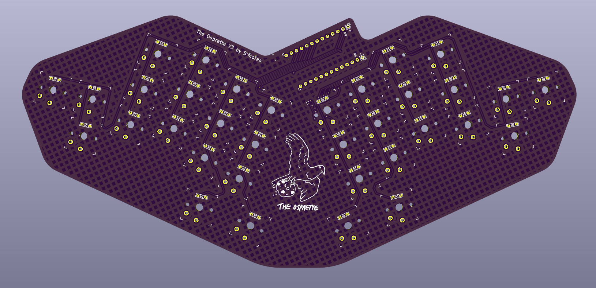

The Osprangle
=============

The Osprangle is a slightly modified version of the [Osprette V3][osprette-v3], fit for a rectangular case.
The case in question is from the [Equals 60][equals-60] from Boardsource. The keyboard is a 34-key unibody
that runs on any pro-micro compatible daughterboard. It comes with bluetooth support by way of battery
terminals and a power switch.

# Ordering One

To order one of these from JLC, just upload the `osprangle.zip` archive to the Order Now page at <https://jlcpcb.com>,
and make sure to set a 1.6mm thickness. Removing the order number is always recommended.

# Pictures

_More to come when PCB's arrive!_

[osprette-v3]: https://github.com/smores56/osprette-v3
[equals-60]: https://www.boardsource.xyz/products/equals-60
