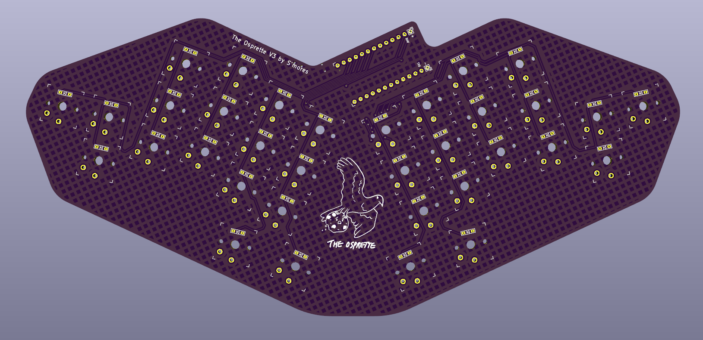

The Osprette V3
===============

The Osprette V3 is the third revision of the [Osprette][osprette]. The keyboard is a
34-key unibody that runs on any pro-micro compatible daughterboard. It comes with
bluetooth support by way of battery terminals and a power switch.

# Ordering One

To order one of these from JLC, just upload the `osprette-v3.zip` archive to the
Order Now page at jlcpcb.com, and make sure to set a 1.6mm thickness. Removing the
order number is always recommended.

# Pictures

_More to come when PCB's arrive!_

[osprette]: https://github.com/smores56/osprette
